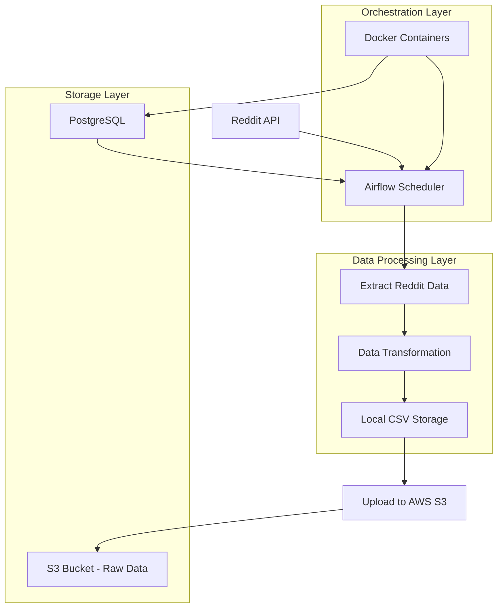

# Reddit Data Pipeline Engineering with Apache Airflow and AWS

[](https://www.python.org/downloads/)
[](https://airflow.apache.org/)
[](https://aws.amazon.com/s3/)
[](https://docs.docker.com/compose/)

## 📋 Table of Contents
- [Overview](#overview)
- [Architecture](#architecture)
- [Project Structure](#project-structure)
- [Technologies Used](#technologies-used)
- [Prerequisites](#prerequisites)
- [Installation & Setup](#installation--setup)
- [Configuration](#configuration)
- [Usage](#usage)
- [Data Pipeline Workflow](#data-pipeline-workflow)
- [API Integration](#api-integration)
- [AWS S3 Integration](#aws-s3-integration)
- [AWS Glue Processing](#aws-glue-processing)
- [Data Transformation](#data-transformation)
- [Monitoring & Logging](#monitoring--logging)
- [Troubleshooting](#troubleshooting)

## 🎯 Overview

This project implements a comprehensive **Reddit Data Pipeline** using Apache Airflow for orchestration and AWS S3 for data storage. The pipeline extracts data from Reddit's API, processes and transforms it, and stores it in a scalable cloud storage solution. This is a production-ready data engineering solution that demonstrates modern data pipeline best practices.

### Key Features:
- **Automated Data Extraction**: Scheduled extraction from Reddit API using PRAW (Python Reddit API Wrapper)
- **Data Transformation**: Clean and standardize Reddit post data for analytics
- **Cloud Storage**: Automatic upload to AWS S3 for scalable data storage
- **Orchestration**: Apache Airflow for workflow management and scheduling
- **Containerization**: Docker-based deployment for consistency across environments

## 🏗️ Architecture



## 📁 Project Structure

```
Reddit Data Pipeline Engineering/
├── 📁 config/                     # Configuration files
│   └── config.conf                # Main configuration file
├── 📁 dags/                       # Airflow DAG definitions
│   └── reddit_data_ingestion.py   # Main DAG for Reddit data pipeline
├── 📁 data/                       # Data storage directories
│   ├── input/                     # Input data files
│   └── output/                    # Processed output files
├── 📁 etls/                       # ETL modules
│   ├── connect_reddit.py          # Reddit API connection & data extraction
│   └── connect_aws.py             # AWS S3 connection & upload utilities
├── 📁 logs/                       # Airflow execution logs
├── 📁 pipelines/                  # Data pipeline modules
│   ├── reddit_pipeline.py         # Reddit data processing pipeline
│   └── aws_s3_pipeline.py         # AWS S3 upload pipeline
├── 📁 postgres/                   # PostgreSQL database files
│   ├── airflow_init.sql           # Database initialization script
│   └── data/                      # PostgreSQL data directory
├── 📁 utils/                      # Utility modules
│   └── constants.py               # Configuration constants and settings
├── 📁 tests/                      # Unit tests (to be implemented)
├── docker-compose.yml             # Docker services configuration
├── requirements.txt               # Python dependencies
├── .env                          # Environment variables
├── .gitignore                    # Git ignore rules
└── README.md                     # Project documentation
```

## 🛠️ Technologies Used

### Core Technologies:
- **Python 3.8+**: Main programming language
- **Apache Airflow 3.0.0**: Workflow orchestration and scheduling
- **PostgreSQL 14**: Airflow metadata database
- **Docker & Docker Compose**: Containerization and orchestration

### Python Libraries:
- **praw**: Python Reddit API Wrapper for Reddit data extraction
- **pandas**: Data manipulation and analysis
- **s3fs**: Python interface for Amazon S3
- **sqlalchemy**: Database toolkit and ORM
- **requests**: HTTP library for API interactions

### Cloud Services:
- **AWS S3**: Scalable object storage for data lake
- **AWS Glue**: Data transformation and analysis
- **AWS IAM**: Identity and access management

### Development Tools:
- **Docker**: Container platform
- **Git**: Version control
- **ConfigParser**: Configuration management

## 📋 Prerequisites

Before setting up this project, ensure you have:

### System Requirements:
- **Docker** (version 20.0+) and **Docker Compose** (version 2.0+)
- **Python 3.8+** (for local development)
- **Git** for version control
- At least **4GB RAM** and **10GB** free disk space

### API Access:
- **Reddit API Credentials**:
  - Reddit account
  - Registered application at https://www.reddit.com/prefs/apps
  - Client ID and Secret Key

### Cloud Services:
- **AWS Account** with:
  - S3 access permissions
  - Access Key ID and Secret Access Key
  - S3 bucket creation permissions

## 🚀 Setup


### Step 1: Set Up Reddit API Credentials

1. **Create Reddit Application**:
   - Go to https://www.reddit.com/prefs/apps
   - Click "Create App" or "Create Another App"
   - Choose "script" as the application type
   - Note down the **Client ID** (under app name) and **Secret Key**

2. **Configure Reddit Credentials**:
   - Update `config/config.conf` with your Reddit API credentials:
   ```ini
   [api_keys]
   reddit_secret_key = YOUR_REDDIT_SECRET_KEY
   reddit_client_id = YOUR_REDDIT_CLIENT_ID
   ```

### Step 2: Set Up AWS Credentials

1. **Create AWS S3 Bucket**:
   - Go to AWS S3 Console
   - Create a new bucket with a unique name
   - Note the bucket name and region

2. **Get AWS Access Keys**:
   - Go to AWS IAM Console
   - Create or use existing user with S3 permissions
   - Generate Access Key ID and Secret Access Key

3. **Configure AWS Credentials**:
   ```ini
   [aws]
   aws_access_key_id = YOUR_AWS_ACCESS_KEY_ID
   aws_secret_access_key = YOUR_AWS_SECRET_ACCESS_KEY
   aws_region = us-east-1
   aws_bucket_name = your-bucket-name
   ```

### Step 3: Environment Variables
Create a `.env` file in the project root:
```bash
# Database
POSTGRES_USER=airflow
POSTGRES_PASSWORD=airflow
POSTGRES_DB=airflow_db

# Airflow
AIRFLOW__CORE__FERNET_KEY=your_fernet_key_here
AIRFLOW__WEBSERVER__SECRET_KEY=your_secret_key_here

# AWS (optional - can use config.conf instead)
AWS_ACCESS_KEY_ID=your_access_key
AWS_SECRET_ACCESS_KEY=your_secret_key
```

### Step 4: Build and Start Services
```bash
# Build and start all services
docker-compose up -d

# Check service status
docker-compose ps

# View logs
docker-compose logs airflow
```

### Step 5: Access Airflow Web UI
- **URL**: http://localhost:8002
- **Username**: admin
- **Password**: admin123

## ⚙️ Configuration

### Configuration File Structure
The `config/config.conf` file contains all necessary configurations:

```ini
[database]
database_host = localhost
database_name = airflow_db
database_port = 5432
database_username = airflow
database_password = airflow

[file_paths]
input_path = /opt/airflow/data/input
output_path = /opt/airflow/data/output

[api_keys]
reddit_secret_key = YOUR_REDDIT_SECRET_KEY
reddit_client_id = YOUR_REDDIT_CLIENT_ID

[aws]
aws_access_key_id = YOUR_AWS_ACCESS_KEY_ID
aws_secret_access_key = YOUR_AWS_SECRET_ACCESS_KEY
aws_region = us-east-1
aws_bucket_name = your-bucket-name

[etl_settings]
batch_size = 100
error_handling = abort
log_level = info
```

### Customizable Parameters:
- **Subreddit**: Change target subreddit in DAG configuration
- **Time Filter**: Adjust data extraction timeframe (hour, day, week, month, year, all)
- **Limit**: Set maximum number of posts to extract
- **Schedule**: Modify DAG schedule interval (@daily, @hourly, etc.)

## 📖 Usage

### Starting the Pipeline

1. **Access Airflow UI**: Navigate to http://localhost:8002
2. **Enable DAG**: Toggle the `reddit_data_ingestion` DAG to "On"
3. **Manual Trigger**: Click "Trigger DAG" for immediate execution
4. **Monitor Progress**: View task status and logs in real-time


### Pipeline Configuration
Modify the DAG parameters in `dags/reddit_data_ingestion.py`:

```python
extract = PythonOperator(
    task_id='extract_reddit_data',
    python_callable=extract_reddit_data,
    op_kwargs={
        'file_name': f'reddit_{dynamic_file_name}',
        'subreddit': 'dataengineering',        # Change subreddit here
        'time_filter': 'day',                  # hour, day, week, month, year, all
        'limit': 1000                          # Number of posts to extract
    }
)
```

### Viewing Results
- **Local Files**: Check `/data/output/` for generated CSV files
- **S3 Storage**: Files uploaded to `s3://your-bucket-name/raw/`
- **Logs**: Monitor execution in Airflow UI or `/logs/` directory


## 🔄 Data Pipeline Workflow

### Task Flow:
```
1. extract_reddit_data → 2. upload_to_s3
```

### Detailed Workflow:

#### 1. **Data Extraction Task** (`extract_reddit_data`)
- **Function**: `extract_reddit_data()` in `pipelines/reddit_pipeline.py`
- **Process**:
  1. Connect to Reddit API using PRAW library
  2. Extract posts from specified subreddit
  3. Apply time filter and limit constraints
  4. Transform raw data into structured format
  5. Save as CSV file locally

#### 2. **S3 Upload Task** (`upload_to_s3`)
- **Function**: `upload_s3_pipeline()` in `pipelines/aws_s3_pipeline.py`
- Create a AWS bucket to store the reddit data
    1. Go to S3 in AWS.
    2. Create a bucket as follows.
    

    

- **Process**:
  1. Retrieve file path from previous task using XCom
  2. Connect to AWS S3 using credentials
  3. Create bucket if it doesn't exist
  4. Upload CSV file to S3 bucket under `/raw/` directory

### Data Flow:
```
Reddit API → Extract Posts → Transform Data → Local CSV → AWS S3 → Data Lake
```

## 🔌 API Integration

### Reddit API Integration
The project uses PRAW (Python Reddit API Wrapper) for seamless Reddit integration:

#### Connection Setup:
```python
def connect_to_reddit_api(client_id, client_secret, user_agent) -> Reddit:
    try:
        reddit = Reddit(
            client_id=client_id,
            client_secret=client_secret,
            user_agent=user_agent
        )
        return reddit
    except Exception as e:
        print(f"Failed to connect to Reddit API: {e}")
        sys.exit(1)
```

#### Data Extraction:
```python
def extract_posts(reddit_instance: Reddit, subreddit: str, time_filter: str, limit=None):
    subreddit = reddit_instance.subreddit(subreddit)
    posts = subreddit.top(time_filter=time_filter, limit=limit)
    
    post_lists = []
    for post in posts:
        post_dict = vars(post)
        post = {key: post_dict[key] for key in POST_FIELDS}
        post_lists.append(post)
    
    return post_lists
```

#### Extracted Fields:
- `id`: Unique post identifier
- `title`: Post title
- `score`: Upvotes minus downvotes
- `num_comments`: Number of comments
- `author`: Post author username
- `created_utc`: Creation timestamp (UTC)
- `url`: Post URL
- `over_18`: NSFW flag
- `edited`: Edit status
- `spoiler`: Spoiler flag
- `stickied`: Sticky post flag

## ☁️ AWS S3 Integration

### S3 Connection Setup
```python
def connect_to_s3():
    try:
        s3 = s3fs.S3FileSystem(
            anon=False,
            key=AWS_ACCESS_KEY,
            secret=AWS_SECRET_KEY
        )
        return s3
    except Exception as e:
        print(e)
```

### Bucket Management
```python
def create_bucket_if_not_exist(s3: s3fs.S3FileSystem, bucket: str):
    try:
        if not s3.exists(bucket):
            s3.mkdir(bucket)
            print("Bucket created")
        else:
            print("Bucket already exists")
    except Exception as e:
        print(e)
```

### File Upload Process
```python
def upload_to_s3(s3: s3fs.S3FileSystem, file_path: str, bucket: str, s3_file_name: str):
    try:
        s3.put(file_path, bucket + '/raw/' + s3_file_name)
        print('File uploaded to s3')
    except FileNotFoundError:
        print('The file was not found')
```

### S3 Folder Structure:
```
your-bucket-name/
└── raw/
    ├── reddit_20250713_142530.csv
    ├── reddit_20250714_142530.csv
    └── reddit_20250715_142530.csv
```

## ☁️ AWS Glue Processing

1. Create a Visual ETL in the AWS Glue Service


2. Create a transformed folder in the same bucket
3. Create a visual pipeline connecting source and target.


5. Combine the last 3 columns


6. Drop the last 3 columns


7. Dump the transformed data in the the new folder


8. Choose the required IAM role so that the glue service has access to S3
9. Save it
10. Run the job.

The transformation code in glue
```
import sys
from awsglue.transforms import *
from awsglue.utils import getResolvedOptions
from pyspark.context import SparkContext
from awsglue.context import GlueContext
from awsglue.job import Job
import gs_concat

args = getResolvedOptions(sys.argv, ['JOB_NAME'])
sc = SparkContext()
glueContext = GlueContext(sc)
spark = glueContext.spark_session
job = Job(glueContext)
job.init(args['JOB_NAME'], args)

# Script generated for node Amazon S3
AmazonS3_node1752458404431 = glueContext.create_dynamic_frame.from_options(format_options={"quoteChar": "\"", "withHeader": True, "separator": ",", "optimizePerformance": False}, connection_type="s3", format="csv", connection_options={"paths": ["s3://reddit-data-ritayan/raw/reddit_20250714_011720.csv"], "recurse": True}, transformation_ctx="AmazonS3_node1752458404431")

# Script generated for node Concatenate Columns
ConcatenateColumns_node1752458545256 = AmazonS3_node1752458404431.gs_concat(colName="ESS_Updated", colList=["edited", "spoiler", "stickied"], spacer="'-'")

# Script generated for node Drop Fields
DropFields_node1752458692209 = DropFields.apply(frame=ConcatenateColumns_node1752458545256, paths=["stickied", "spoiler", "edited"], transformation_ctx="DropFields_node1752458692209")

# Script generated for node Transformed Data
TransformedData_node1752458721380 = glueContext.write_dynamic_frame.from_options(frame=DropFields_node1752458692209, connection_type="s3", format="csv", connection_options={"path": "s3://reddit-data-ritayan/transformed/", "partitionKeys": []}, transformation_ctx="TransformedData_node1752458721380")

job.commit()
```


11. Create a Glue Crawler with Database

12. Now create the glue crawler

13. Run the crawler and the database will be populated with metadata information about the file


14. Now go to Athena and visualize the table


Different analysis can be performed in the AWS Athena.


## 🔄 Data Transformation

### Transformation Pipeline
The `transform_data()` function in `etls/connect_reddit.py` performs several data cleaning operations:

```python
def transform_data(post_df: pd.DataFrame):
    # Convert Unix timestamp to datetime
    post_df['created_utc'] = pd.to_datetime(post_df['created_utc'], unit='s')
    
    # Standardize boolean values
    post_df['over_18'] = np.where((post_df['over_18'] == True), True, False)
    
    # Convert author to string
    post_df['author'] = post_df['author'].astype(str)
    
    # Handle edited field with mode imputation
    edited_mode = post_df['edited'].mode()
    post_df['edited'] = np.where(
        post_df['edited'].isin([True, False]),
        post_df['edited'], 
        edited_mode
    ).astype(bool)
    
    # Ensure numeric fields are proper integers
    post_df['num_comments'] = post_df['num_comments'].astype(int)
    post_df['score'] = post_df['score'].astype(int)
    post_df['title'] = post_df['title'].astype(str)
    
    return post_df
```

### Data Quality Improvements:
- **Timestamp Conversion**: Unix timestamps converted to readable datetime
- **Data Type Standardization**: Ensure consistent data types across fields
- **Boolean Normalization**: Handle various boolean representations
- **Missing Value Handling**: Mode imputation for edited field
- **String Sanitization**: Ensure text fields are properly formatted

## 📊 Monitoring & Logging

### Airflow Web UI Features:
- **DAG View**: Visual representation of task dependencies
- **Task Status**: Real-time monitoring of task execution
- **Log Viewer**: Detailed execution logs for debugging
- **Task Duration**: Performance metrics and execution times
- **Error Tracking**: Failed task identification and error messages


### Log Locations:
- **Airflow Logs**: `/logs/dag_id=reddit_data_ingestion/`
- **Container Logs**: `docker-compose logs airflow`
- **Database Logs**: PostgreSQL logs in container

### Monitoring Commands:
```bash
# View Airflow container logs
docker-compose logs airflow

# View PostgreSQL logs
docker-compose logs db

# Check service status
docker-compose ps

# Monitor resource usage
docker stats
```

## 🐛 Troubleshooting

### Common Issues & Solutions:

#### 1. **Reddit API Connection Failed**
**Error**: `Failed to connect to Reddit API`
**Solution**:
- Verify Reddit API credentials in `config/config.conf`
- Check if Reddit application is properly configured
- Ensure User-Agent string is provided

#### 2. **AWS S3 Upload Failed**
**Error**: `The file was not found` or permission errors
**Solution**:
- Verify AWS credentials and permissions
- Check S3 bucket name and region
- Ensure IAM user has S3 write permissions

#### 3. **Airflow Won't Start**
**Error**: Database connection issues
**Solution**:
```bash
# Reset Airflow database
docker-compose down -v
docker-compose up -d
```

#### 4. **Port Already in Use**
**Error**: `Port 8002 is already allocated`
**Solution**:
- Change ports in `docker-compose.yml`
- Kill existing processes using the port

#### 5. **Memory Issues**
**Error**: Container restarts or OOM errors
**Solution**:
- Increase Docker memory allocation
- Reduce batch size in configuration
- Monitor resource usage with `docker stats`


